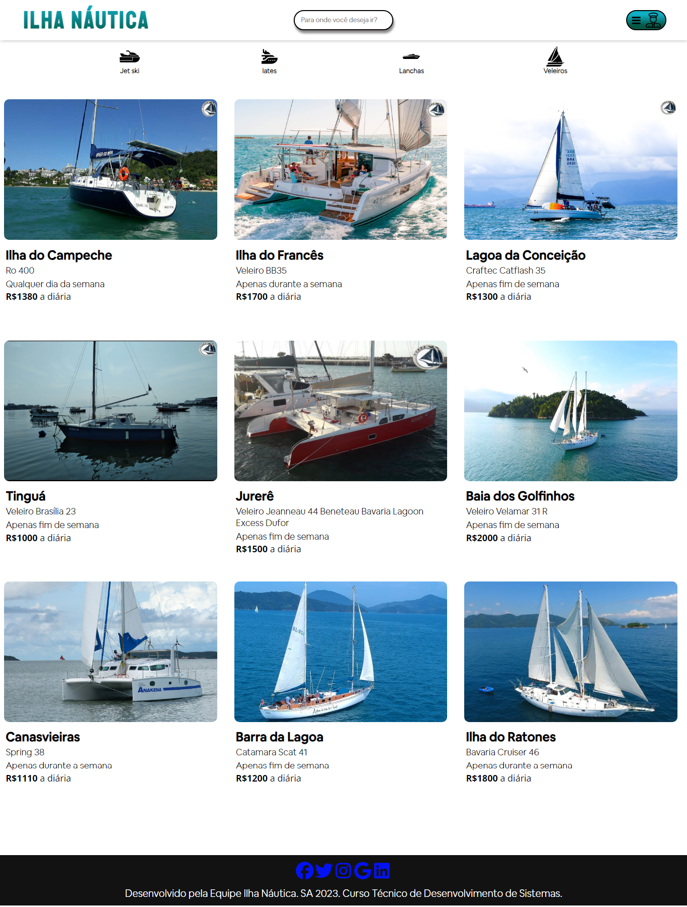
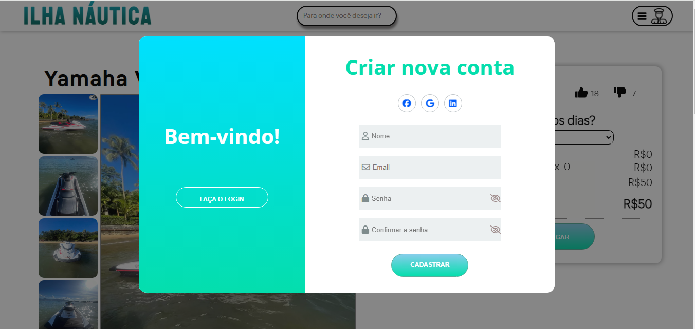
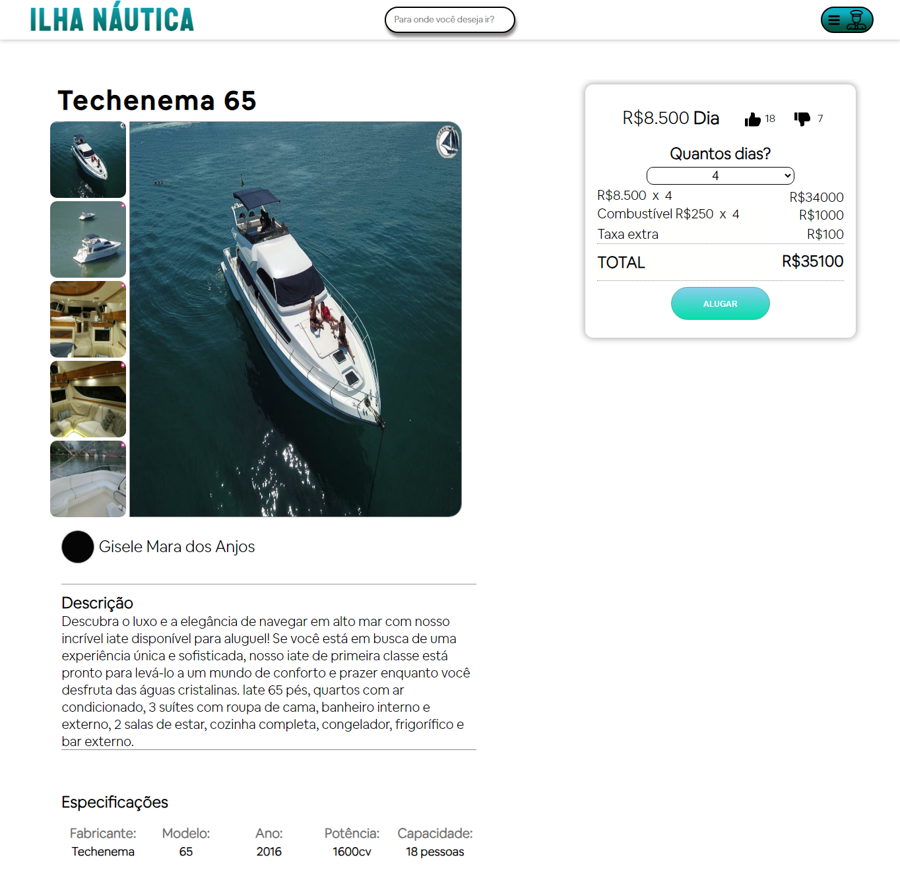
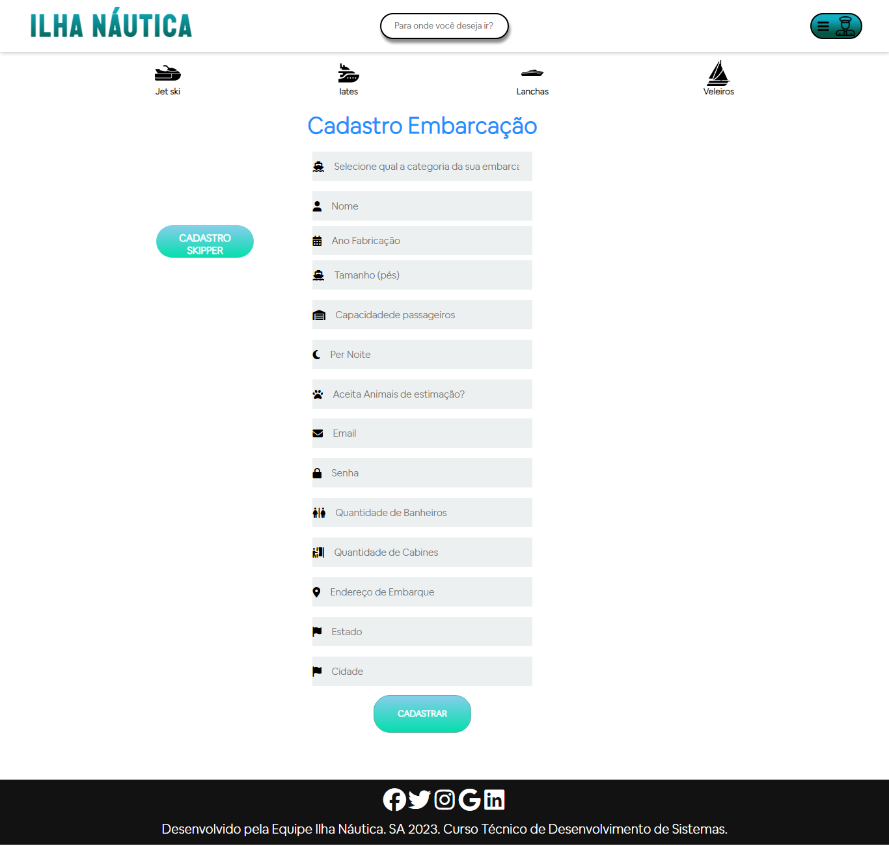

# Ilha Náutica
## SA 2023.1

Este projeto foi desenvolvido como parte da Situação de Aprendizagem (SA) do primeiro semestre do curso Técnico em Desenvolvimento de Sistemas do SENAI.

## Sobre o Projeto

O Ilha Náutica é uma plataforma web voltada para o aluguel de barcos, proporcionando uma maneira conveniente para donos de embarcações disponibilizarem seus barcos para aluguel, para pessoas interessadas em passeios turísticos e para skippers (marinheiros) que desejam pilotar essas embarcações. O projeto visa facilitar o processo de aluguel de barcos, conectando proprietários de barcos e locatários.

## Funcionalidades

- **Cadastro de Barcos:** Os proprietários de embarcações podem cadastrar seus barcos na plataforma, fornecendo informações detalhadas sobre a embarcação, como capacidade, modelo e ano de criação.

- **Aluguel de Barcos:** Os usuários interessados em alugar uma embarcação podem pesquisar e visualizar os barcos disponíveis para aluguel, selecionando aquele que melhor atenda às suas necessidades e requisitos.

- **Armazenamento Local:** Todas as informações, incluindo detalhes dos barcos e usuários cadastrados,  e histórico de aluguéis, são armazenadas localmente no navegador, utilizando a funcionalidade de localStorage.

## Tecnologias Utilizadas

- Frontend: HTML, CSS, JavaScript
- Armazenamento de Dados: LocalStorage

## Observações

- Site projetado para tela de 1366 x 641. Não responsivo.

## Equipe

- Alexsandro Silva
- Andrey Lopes
- Enzo Lira
- Erick Ribeiro
- Gisele Mara 

## Imagens

  
Ilha Náutica - Front

  
  
  
  
  

